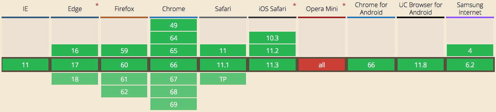
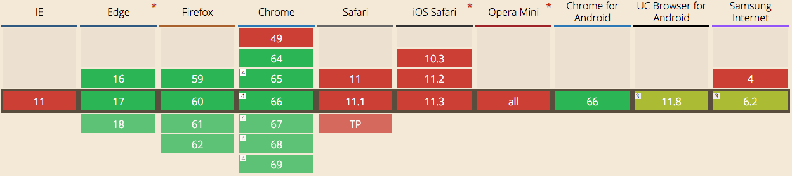

# MutationObserver

> MutationObserver provides developers with a way to react to changes in a DOM. It is designed as a replacement for Mutation Events defined in the DOM3 Events specification.



## Example

```js
// Select the node that will be observed for mutations
const targetNode = document.getElementById('some-id');

// Create an observer instance
const observer = new MutationObserver((mutationsList) => {
    // Check for changes on the observed element
    for (let mutation of mutationsList) {
        if (mutation.type == 'childList') {
            console.log('A child node has been added or removed.');
        }

        else if (mutation.type == 'attributes') {
            console.log('The ' + mutation.attributeName + ' attribute was modified.');
        }
    }
});

// Options for the observer (which mutations to observe)
const config = {
    attributes: true,
    childList: true,
};

// Start observing the target node for configured mutations
observer.observe(targetNode, config);

// Later, you can stop observing
observer.disconnect();
```

## Available options
| Property | Description |
| -------- | ----------- |
| childList | Set to true if additions and removals of the target node's child elements (including text nodes) are to be observed. |
| attributes | Set to true if mutations to target's attributes are to be observed. |
| characterData | Set to true if mutations to target's data are to be observed. |
| subtree | Set to true if mutations to target and target's descendants are to be observed. |
| attributeOldValue | Set to true if attributes is set to true and target's attribute value before the mutation needs to be recorded. |
| characterDataOldValue | Set to true if characterData is set to true and target's data before the mutation needs to be recorded. |
| attributeFilter | Set to an array of attribute local names (without namespace) if not all attribute mutations need to be observed. |

# IntersectionObserver

> The Intersection Observer API provides a way to asynchronously observe changes in the intersection of a target element with an ancestor element or with a top-level document's viewport.



## Example

```js
// Select the node that will be observed for intersection
const targetNode = document.getElementById('some-id');

// Options for the observer
const options = {
    root: null,
    rootMargin: '0px',
};

// Create an observer instance
const observer = new IntersectionObserver((entries) => {
    entries.forEach((entry) => {
        // check if the node is intersecting
        if (entry.isIntersecting) {
            console.log('node is intersecting', entry.intersectionRatio);
        } else {
            console.log('node is not intersecting');
        }
    });
}, options);

// Start observing
observer.observe(targetNode);

// Later, you can stop observing
observer.unobserve(targetNode);
```

## Available options
| Property | Description |
| -------- | ----------- |
| root | The element that is used as the viewport for checking visiblity of the target. Must be the ancestor of the target. Defaults to the browser viewport if not specified or if null. |
| rootMargin | Margin around the root. Can have values similar to the CSS margin property, e.g. "10px 20px 30px 40px" (top, right, bottom, left). The values can be percentages. This set of values serves to grow or shrink each side of the root element's bounding box before computing intersections. Defaults to all zeros. |
| threshold | Either a single number or an array of numbers which indicate at what percentage of the target's visibility the observer's callback should be executed. If you only want to detect when visibility passes the 50% mark, you can use a value of 0.5. If you want the callback run every time visibility passes another 25%, you would specify the array [0, 0.25, 0.5, 0.75, 1]. The default is 0 (meaning as soon as even one pixel is visible, the callback will be run). A value of 1.0 means that the threshold isn't considered passed until every pixel is visible. |

# Page Visibility API

> With tabbed browsing, there is a reasonable chance that any given webpage is in the background and thus not visible to the user. The Page Visibility API provides events you can watch for to know when a document becomes visible or hidden, as well as features to look at the current visibility state of the page.


## Example

```js
document.addEventListener('visibilitychange', () => {
    const isVisible = typeof document.hidden !== 'undefined' ? !document.hidden : true;
    console.log('Tab is', !isVisible ? 'not' : '', 'visible');
});
```

# New Wideboard on Energy.ch

The visibility rate of the wideboard ad is currently not that good, so we would like to introduce the following changes to improve it:

- Move the wideboard before our news slider
- If the ad was not visible for 5s (because the user scrolled down, maybe even before it has loaded), add it as a fixed div at the top of the page until it has been viewed for 5s
- The 5s should only start when the ad has loaded
- The 5s should only count when the tab is visible
- It should only be added as a fixed div if it actually has loaded, we don't want an empty fixed container overlapping our content/navigation
