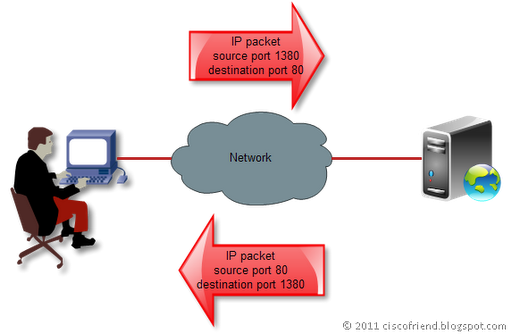
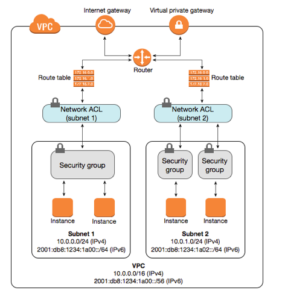

## Ephemeral Ports

When you open a connection to another server, the response is normally not received on the same port but on another one which is currently free and just got opened for receiving an answer.
All systems reserve a specific range for such dynamic ports which are called Ephemeral ports. Most Unix kernels for example use 32768 to 61000.

* they are shortlived ports
* every connection gets another free port so they are not predictable (although they are always in the defined range)

  
Why do we need those ports?

  This way, multiple connections to the same destination port can get opened at the same time (e.g. two concurrent website requests) which would not be possible if it would always get returned on the same port

# Ephemeral Ports and Firewalls

We have defined the following rules in our firewall:

**inbound**:

| Order | Port | Status |
| ----- | ---- | ------ |
| 1 | **22** | ALLOWED |
| 2 | **80** | ALLOWED |
| 3 | **443** | ALLOWED |
| 4 | * | BLOCKED |

**outbound**:

| Order | Port | Status |
| ----- | ---- | ------ |
| 1 | * | ALLOWED |

We obviously want to allow incoming traffic only on ports *22*, *80* and *443* and allow *all* outbound traffic so we can still call 3rd party APIs or open any other connection to external servers.

  
Will this work or do you see any problems?

  It depends on whether the firewall is stateless or statefull.

  We had a problem configuring firewalls in our AWS setup recently because we didn't thought about ephemeral ports when we configured the firewalls and so we were able to connect to the instance but any outgoing request on it simply timed out.

## Stateless vs. stateful firewalls

A stateless firewall..

* treats each packet independently
* is not aware of traffic patterns or data flow

While a stateful firewall..

* can remember connection-level information
* knows if a packet is a response to another request
* knows the current state of a connection

  
Which firewall will now work as expected with the rules defined above? And how can we change the other one that it also works as expected?

  The stateful firewall will work as expected as it knows, that even if the incoming port is 32768, it is a response to a connection we have opened and as all outgoing connections should be allowed, the firewall lets the packages pass.

  But the stateless firewall doesn't know that. We have to additionally allow all ports between 32768 and 61000 on the stateless firewall.

## AWS

There are two different kinds of "firewalls" at AWS: Network ACL and Security Groups.

  
Which one is stateful and which is stateless?

  The one which is nearer to the EC2 instances is stateful, so Security Groups are stateful while Network ACLs watch the traffic on network level and are stateless.

  So when we want our initial firewall definition to work at AWS, we have to allow the epheremal ports on the Network ACL layer.

